## Babel是什么？

babel 是一个转译器，暴露了很多 api，用这些 api 可以完成代码到 AST 的解析、转换、以及目标代码的生成。

## Babel在前端工具中的定位

主要有以下场景：

1. 语法转换。主要是语法降级或者是源码转换，比如jsx
2. polyfill特性的实现和接入
3. 源码转换，比如jsx

换成支持的能力来说：

1. 使用最新的 JavaScript 功能编写代码
2. 将其转换为在旧环境中运行的兼容代码
3. 根据其要求定位特定环境


## Babel的编译过程

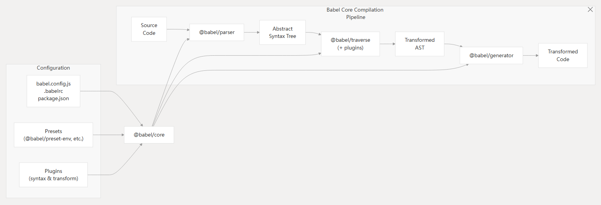

Babel处理流程是 代码 -> 代码 的过程，主要的流程分三步：

1. parse：通过 parser 把源码转成抽象语法树（AST）
2. transform：遍历 AST，调用各种 transform 插件对 AST 进行增删改
3. generate：把转换后的 AST 打印成目标代码，并生成 sourcemap

## AST（抽象语法树）

下边是代码`console.log('hello world')`对应的AST:

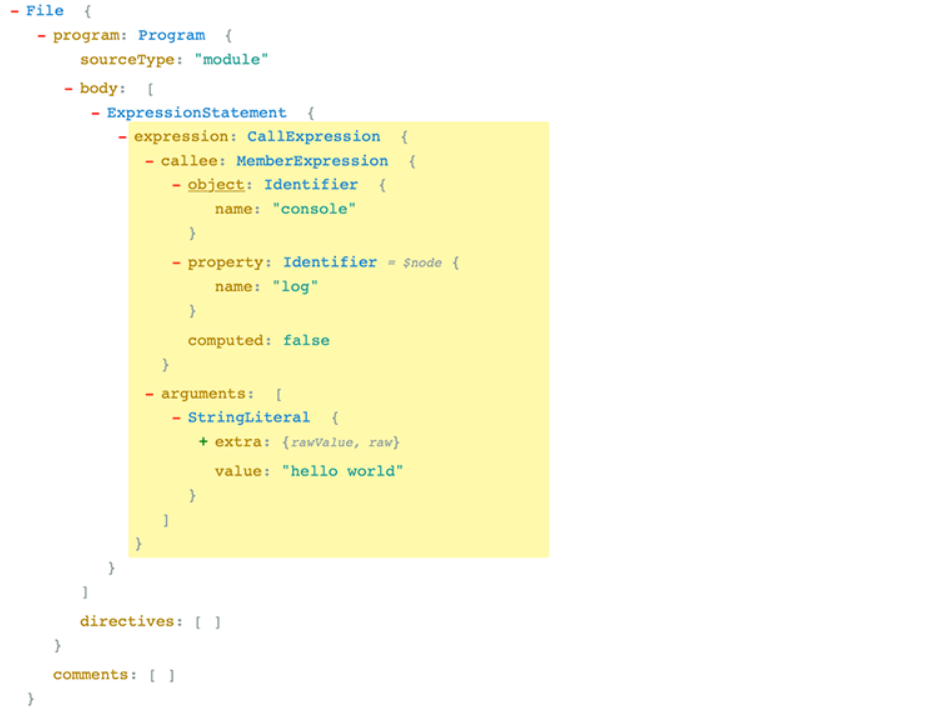

Program、CallExpression、Identifier 这些都是节点的类型，每个节点都是一个有意义的语法单元。 这些节点类型定义了一些属性来描述节点的信息

所以，直观点来讲就是一个js对象，包含节点和节点信息。

## 常见的节点


上边是节点的关系，所有的节点都会继承BaseNode，BaseNode的定义如下：

```ts
interface BaseNode {
  type: Node["type"];
  leadingComments?: Comment[] | null;
  innerComments?: Comment[] | null;
  trailingComments?: Comment[] | null;
  start?: number | null;
  end?: number | null;
  loc?: SourceLocation | null;
  range?: [number, number];
  extra?: Record<string, unknown>;
}
```
核心的节点类型有：

| Category |	Examples	| Purpose 
| -- | --| --|
| Expressions |	BinaryExpression, CallExpression	| Represent code that produces values
| Statements |	IfStatement, ForStatement	| Represent code that performs actions
| Declarations |	FunctionDeclaration, ClassDeclaration	| Introduce bindings into the scope
| Literals |	StringLiteral, NumericLiteral	| Represent primitive values
| Patterns |	ObjectPattern, ArrayPattern	| Used in destructuring assignments

每种类型的节点又会有更具体的分类。比如字面量类型的节点：

| `'gang'` | StringLiteral |
| --- | --- |
| ``` `guang` ``` | TemplateLiteral |
| `123` | NumericLiteral |
| `/^[a-z]+/` | RegExpLiteral |
| `True` | BooleanLiteral |
| `1.232434n` | BigintLiteral |
| `null` | NullLiteral | 


## AST 可视化查看工具

[astexplorer.net](https://astexplorer.net/)，这个网站可以查看代码 parse 以后的 AST，可以切换 parse 的语言和用的 parser，也可以修改 parse options。

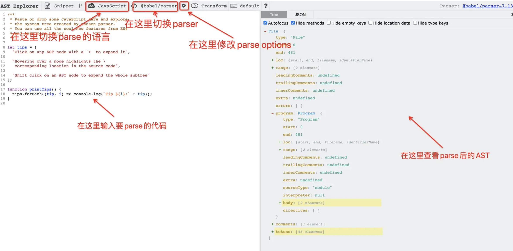

通过这个网站，我们可以看到具体的节点类型，通常是配合@babel/types这个包来校验节点类型

```ts
import * as t from '@babel/types';

if (t.isBinaryExpression(node)) {
  // It's safe to access node.operator, node.left, node.right
}

// You can also check for specific properties
if (t.isBinaryExpression(node, { operator: '+' })) {
  // This is a binary addition expression
}
```

具体的节点类型可以查看[源码中的类型定义](https://github.com/babel/babel/blob/main/packages/babel-types/src/ast-types/generated/index.ts)

## Babel核心包

上边提到了@babel/types，顺便提下另外有几个核心的包，这些包在开发Babel插件都是很有用处的

|Package| Purpose |
|---|---|
|@babel/core |转换管道的主要入口点和编排
|@babel/parser |将 JavaScript 代码解析为抽象语法树 （AST）
|@babel/traverse  |处理 AST 遍历并支持转换
|@babel/generator|从 AST 生成 JavaScript 代码
|@babel/types |用于 AST 节点创建、验证和操作的工具包
|@babel/template  |基于模板的 AST 节点创建实用程序

## 具体的API

这块没有什么好说的，以最新[官方文档](https://www.babeljs.cn/docs/babel-parser)为主

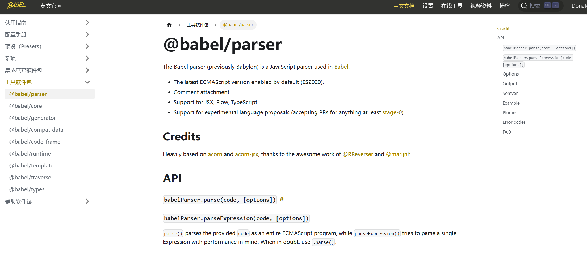

## 节点遍历

这里有两个关键的概念：

1. NodePath
2. 访问者模式

### NodePath

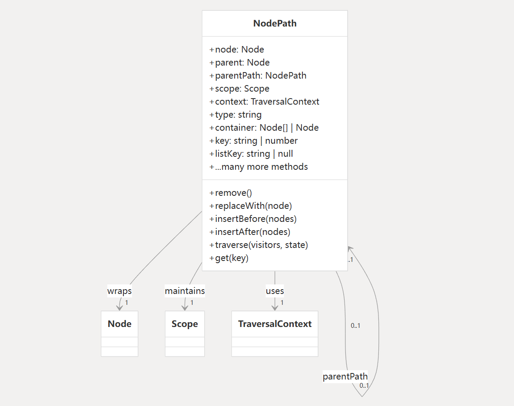

可以把它当成一个上下文对象。主要包含：

1. 当前节点信息
2. 父子、兄弟节点的信息
3. 作用域信息
4. 上下文信息
5. 节点的操作方法
6. 断言方法（isXXX, assertXXX）

定义如下：

```ts
export class NodePath<T = Node> {
    constructor(hub: Hub, parent: Node);
    parent: Node;
    hub: Hub;
    contexts: TraversalContext[];
    data: object;
    shouldSkip: boolean;
    shouldStop: boolean;
    removed: boolean;
    state: any;
    opts: object;
    skipKeys: object;
    parentPath: NodePath;
    context: TraversalContext;
    container: object | object[];
    listKey: string; // 如果节点在一个数组中，这个就是节点数组的键
    inList: boolean;
    parentKey: string;
    key: string | number; // 节点所在的键或索引
    node: T;  // 🔴 当前节点
    scope: Scope; // 🔴当前节点所在的作用域
    type: T extends undefined | null ? string | null : string; // 🔴节点类型
    typeAnnotation: object;
    // ... 还有很多方法，实现增删查改
}
```

> 具体如何使用path，可以查阅babel插件开发的文档: [https://github.com/jamiebuilds/babel-handbook/blob/master/translations/zh-Hans/plugin-handbook.md#toc-visitors](https://github.com/jamiebuilds/babel-handbook/blob/master/translations/zh-Hans/plugin-handbook.md#toc-visitors)

### 访问者模式

访问者模式是定义在遍历过程中遇到特定节点类型时会发生什么情况的主要机制。

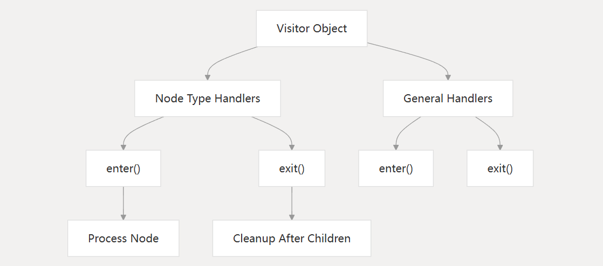

## 插件开发

Babel 插件在 Babel 的转换管道中运行，整体的架构设计如下：

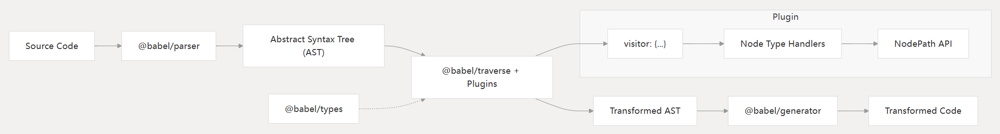

一个插件的基本结构如下：

```ts
export default function myPlugin(api) {
  const { types: t } = api;
  
  return {
    name: "my-plugin", // optional
    visitor: {
      // Visit methods for different node types
      Identifier(path, state) {
        // Transform Identifier nodes
      },
      BinaryExpression(path, state) {
        // Transform BinaryExpression nodes
      }
      // Add more visit methods as needed
    }
  };
}
```

在了解插件开发之前需要了解NodePath操作节点的方法：

1. 访问父节点或者祖先节点

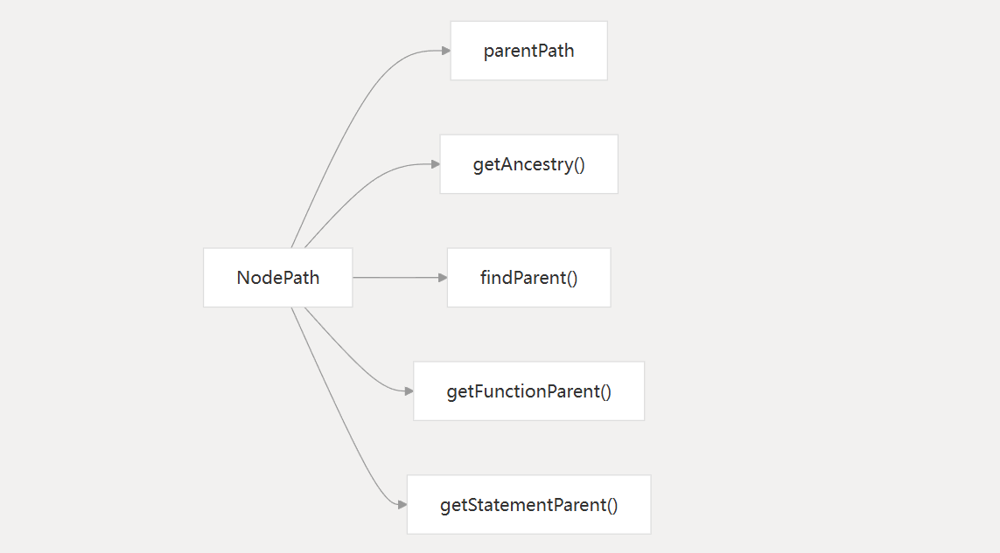

2. 节点替换

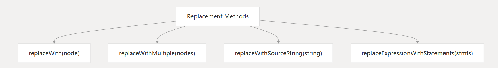

3. 节点插入

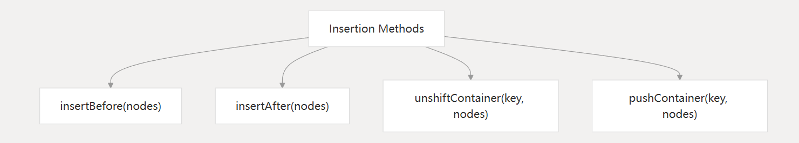

4. 节点删除

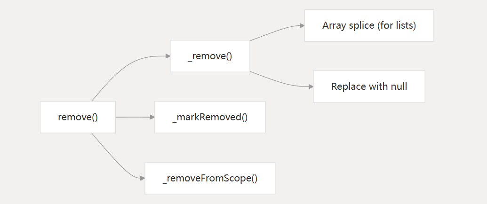

### 简单案例

Babel 插件允许你自定义对 JavaScript 代码的处理方式，比如转换语法、优化代码等。下面是一个简单的 Babel 插件示例，这个插件的作用是查找所有的 `console.log` 语句，并在它们前面添加一条注释，说明这个 `console.log` 语句被找到了。

首先，你需要安装 Babel 相关的依赖：

```bash
npm install --save-dev @babel/core @babel/cli @babel/preset-env
```

然后，创建一个名为 `simple-babel-plugin.js` 的文件，内容如下：

```javascript
module.exports = function(babel) {
  const t = babel.types; // 访问 Babel 的 types 工具库

  return {
    name: "simple-console-log-plugin", // 插件名称

    visitor: {
      // 访问不同类型的节点
      CallExpression(path) {
        // 检查是否是 console.log 调用
        if (
          path.node.callee.type === "MemberExpression" &&
          path.node.callee.object.name === "console" &&
          path.node.callee.property.name === "log"
        ) {
          // 在 console.log 前插入注释
          path.insertBefore(
            t.commentLine(" This console.log statement has been found by the plugin.")
          );
        }
      },
    },
  };
};
```

接下来，创建一个 `.babelrc` 配置文件，指定使用你的插件和 `@babel/preset-env` 预设：

```json
{
  "presets": ["@babel/preset-env"],
  "plugins": ["./simple-babel-plugin.js"]
}
```

最后，创建一个测试文件 `test.js`，写入以下代码：

```javascript
console.log("Hello, world!");
```

使用 Babel 命令行工具运行转换：

```bash
npx babel test.js -o output.js
```

转换后的 `output.js` 文件内容应该类似于：

```javascript
// This console.log statement has been found by the plugin.
console.log("Hello, world!");
```

这个例子展示了如何创建一个简单的 Babel 插件，它在每次 `console.log` 调用前添加了一条注释。你可以根据需要修改插件逻辑，实现更复杂的代码转换功能。