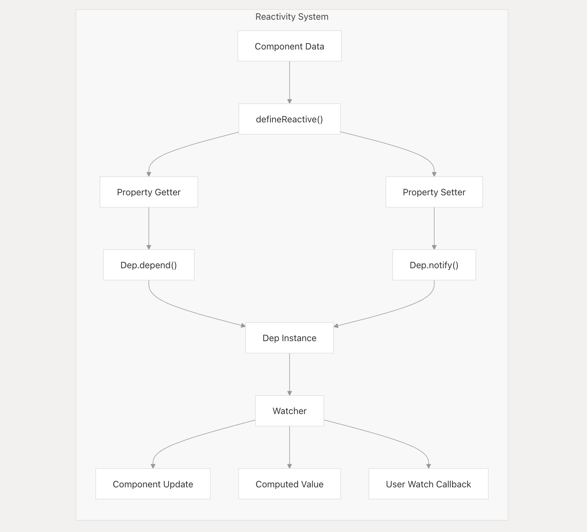
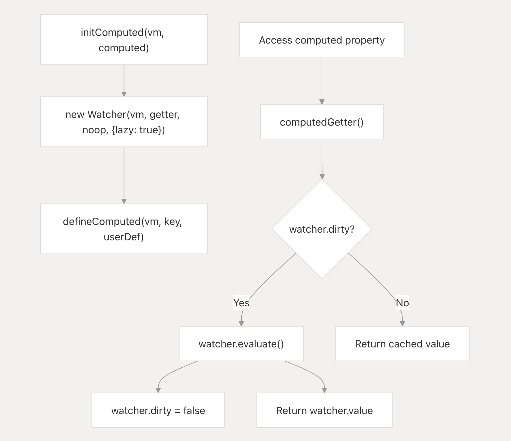

## 响应式系统中的Watcher



Vue2响应式中更新这部分主要是通过Watcher这个类来实现（这里特指实现上，不包含其它部分），Watcher主要会分成以下几种：

| watcher type | created by | purpose |
| --- | --- | --- |
| Render Watcher | Component mounting | Updates component view when data changes |
| Computed Watcher | Computed property | Caches and recalculates derived values |
| User Watcher | User-defined by watch option/function | Executes user-defined callback functions on data changes |

## 如何理解计算属性（Lazy Watcher）惰性更新

计算属性会创建懒惰的观察者（属性变化触发的update是懒惰的，只有在需要的时候才会去更新），只有当其依赖关系发生变化时才会重新评估：



当属性变化的时候，调用watcher update，由于创建watcher的lazy属性为true，dirty会被设置为true（update函数仅干了这么一件事情）：

```js
  /**
   * Subscriber interface.
   * Will be called when a dependency changes.
   */
  update() {
    /* istanbul ignore else */
    if (this.lazy) {
      this.dirty = true
    } else if (this.sync) {
      this.run()
    } else {
      queueWatcher(this)
    }
  }
```

下边是创建计算属性getter的代码，也就是计算属性被访问的时候会调用：

```js
function createComputedGetter(key) {
  return function computedGetter() {
    const watcher = this._computedWatchers && this._computedWatchers[key]
    if (watcher) {
      if (watcher.dirty) {
        watcher.evaluate()
      }
      if (Dep.target) {
        if (__DEV__ && Dep.target.onTrack) {
          Dep.target.onTrack({
            effect: Dep.target,
            target: this,
            type: TrackOpTypes.GET,
            key
          })
        }
        watcher.depend()
      }
      return watcher.value
    }
  }
}
```

只有当dirty为true的时候才会重新计算，否则都是取watcher.value（旧值）。
```js
  evaluate() {
    this.value = this.get()
    this.dirty = false
  }
```

这里的get就是计算属性的getter函数，dirty会在evaluate中被设置为false。
```js
  get() {
    pushTarget(this)
    const value = this.fn.call(this.vm, this.vm)
    popTarget()
    return value
  }
```

所以，我们可以这样去理解：计算属性依赖的属性发生变化的时候，update会被调用，dirty会被设置为true，但是由于计算属性的getter函数不会被调用，计算属性不会触发重新计算。只有当计算属性被访问的时候才会去调用getter函数，这时候才会去执行evaluate方法，重新计算值并设置dirty为false。这样就实现了惰性更新。

## 分批更新（Batched Updates）

通过异步队列更新，多个属性触发的更新会被合并成一个批量更新，这样可以减少DOM操作的次数，提高性能（Vue2使用了微任务（Microtask）来实现异步队列更新）。

还是看Watcher的update方法：

```js
  update() {
    /* istanbul ignore else */
    if (this.lazy) {
      this.dirty = true
    } else if (this.sync) {
      this.run()
    } else {
      queueWatcher(this)
    }
  }
```

> 相关的源码文件 [https://github.com/vuejs/vue/blob/main/src/core/observer/scheduler.ts](https://github.com/vuejs/vue/blob/main/src/core/observer/scheduler.ts)

```ts
export function queueWatcher(watcher: Watcher) {
  const id = watcher.id
  if (has[id] != null) {
    return
  }

  if (watcher === Dep.target && watcher.noRecurse) {
    return
  }

  has[id] = true
  if (!flushing) {
    queue.push(watcher)
  } else {
    // if already flushing, splice the watcher based on its id
    // if already past its id, it will be run next immediately.
    let i = queue.length - 1
    while (i > index && queue[i].id > watcher.id) {
      i--
    }
    queue.splice(i + 1, 0, watcher)
  }
  // queue the flush
  if (!waiting) {
    waiting = true

    if (__DEV__ && !config.async) {
      flushSchedulerQueue()
      return
    }
    nextTick(flushSchedulerQueue)
  }
}
```

这里的queueWatcher就是将watcher放入一个队列中，在nextTick中去执行flushSchedulerQueue方法，flushSchedulerQueue方法会去执行queue中的watcher的run方法，去更新视图。（nextTick方法会根据当前的环境去选择使用Promise、MutationObserver、setImmediate、setTimeout等方法来实现异步更新。这里不是我们这次的重点，所以就不展开了）也就是把更新操作放到下一个事件循环中去执行，这样就可以实现多个属性触发的多次更新合并成一次分批更新。

这里提一下flushSchedulerQueue相关的内容：

```ts
/**
 * Flush both queues and run the watchers.
 */
function flushSchedulerQueue() {
  currentFlushTimestamp = getNow()
  // 重置flushing状态
  flushing = true
  let watcher, id

  // Sort queue before flush.
  // This ensures that:
  // 1. Components are updated from parent to child. (because parent is always
  //    created before the child)
  // 2. A component's user watchers are run before its render watcher (because
  //    user watchers are created before the render watcher)
  // 3. If a component is destroyed during a parent component's watcher run,
  //    its watchers can be skipped.
  queue.sort(sortCompareFn)

  // do not cache length because more watchers might be pushed
  // as we run existing watchers
  for (index = 0; index < queue.length; index++) {
    watcher = queue[index]
    if (watcher.before) {
      watcher.before()
    }
    id = watcher.id
    has[id] = null
    watcher.run()
    // in dev build, check and stop circular updates.
    if (__DEV__ && has[id] != null) {
      circular[id] = (circular[id] || 0) + 1
      if (circular[id] > MAX_UPDATE_COUNT) {
        warn(
          'You may have an infinite update loop ' +
            (watcher.user
              ? `in watcher with expression "${watcher.expression}"`
              : `in a component render function.`),
          watcher.vm
        )
        break
      }
    }
  }

  // keep copies of post queues before resetting state
  const activatedQueue = activatedChildren.slice()
  const updatedQueue = queue.slice()

  resetSchedulerState()

  // call component updated and activated hooks
  callActivatedHooks(activatedQueue)
  callUpdatedHooks(updatedQueue)
  cleanupDeps()

  // devtool hook
  /* istanbul ignore if */
  if (devtools && config.devtools) {
    devtools.emit('flush')
  }
}
```

里边有几件重要的事情：

1. 重置`flushing`状态：在执行完所有的watcher之后，重置`flushing`状态为false，表示可以再次开始新的更新。
2. `queue.sort(sortCompareFn)`：对队列进行排序，确保父组件在子组件之前更新，用户watcher在渲染watcher之前更新。保证的方法就是根据watcher的id进行排序，因为watcher的id是叠加的。
3. `has[id] = null`：将当前watcher的id在has对象中设置为null，表示当前watcher已经被执行过了，通过queueWatcher函数可以看出是为了避免同一个wacher同时执行更新。
4. `watcher.run()`：执行当前watcher的run方法，更新视图。
5. `circular[id] = (circular[id] || 0) + 1`：检查是否有循环更新，如果超过了最大更新次数（MAX_UPDATE_COUNT = 100），则抛出警告。
6. `callActivatedHooks(activatedQueue)`：调用激活钩子函数，这里指keepAlive的组件。
7. `callUpdatedHooks(updatedQueue)`：调用更新钩子函数。
8. `cleanupDeps()`：清理依赖关系。
9. `resetSchedulerState()`：重置调度器状态，清空队列和activatedChildren。
10. `devtools.emit('flush')`：如果开启了devtools，则触发flush事件。
