为什么把 EffectScope 和 activeSub放在一起讲，两者都与Vue3的中的副作用函数有关，ok，来看下两者的概念和作用

## EffectScope

在Vue3的官方文档中，我们可以看到有个EffectScope的API：

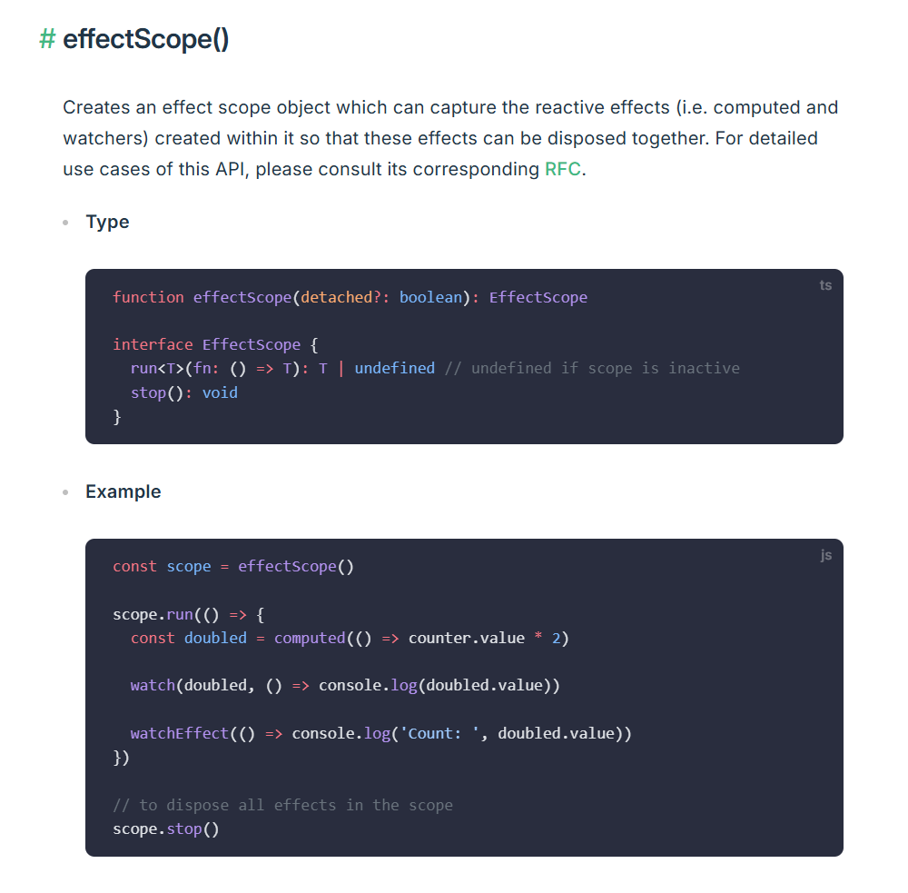

它的作用是创建一个副作用函数的作用域，在其内创建的reactive effect（watchers & computers i.e）都会被收集到同一个scope中，方便一起控制。

具体的场景：

1. 为一组effect提供生命周期管理。当一个组件将要被卸载的时候，你可以调用scope.stop一次性去清理相关的副作用函数
2. 组件集成。每一个组件在创建的时候，都会创建一个EffectScope，在组件setup和render的时候能够正确的切换activeEffectScope，去收集reactive effect
   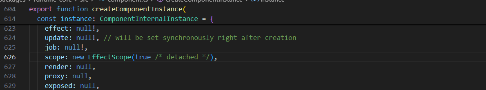
   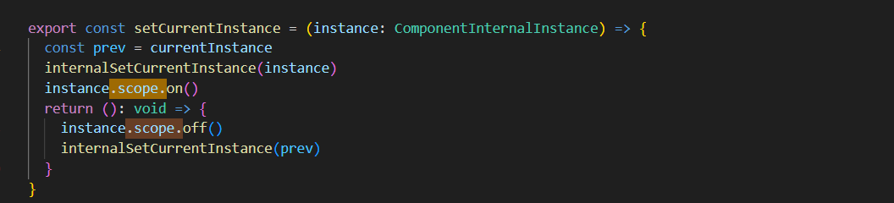
   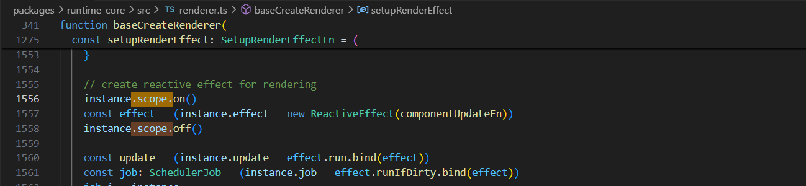

effectScope中effects的收集:
1. new EffectScope的时候（调用effectScope api创建），effectScope的active属性会置为true
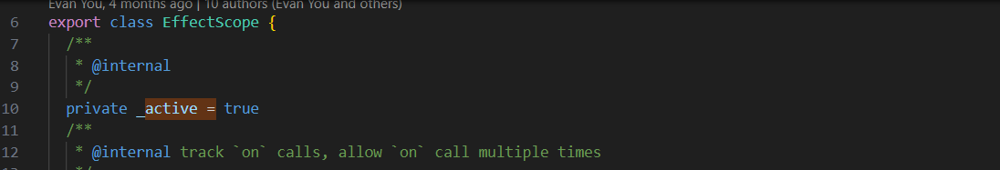
2. 调用run函数设置activeEffect
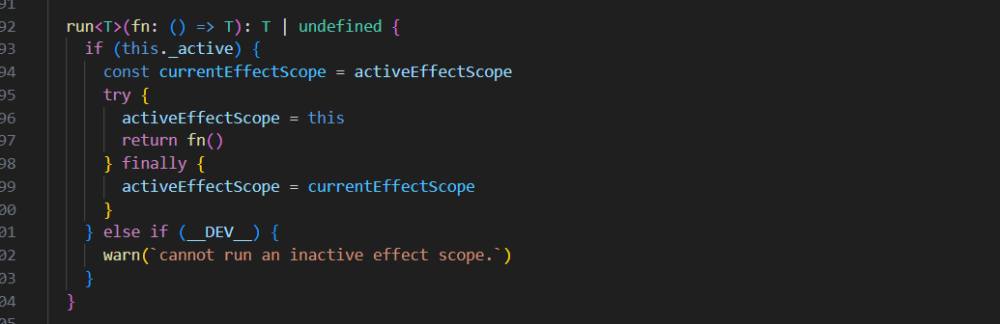
1. 调用watch等api，即在每次new ReactiveEffect会把effect推入effectScope.effects

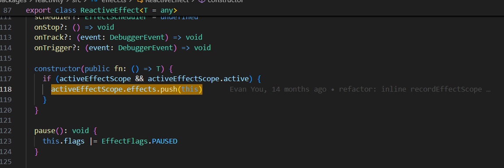

3. 最后调用.stop将active置为false

## activeSub

上边有提到activeEffectScope，这是一个全局的变量，标记当前的scope，与之类似并且和Reactive Effect有关的全局变量还有一个，activeSub

它是用来标记当前活跃的副作用函数（active effect）或者叫当前的订阅者，主要功能就是在响应式系统中，让Vue能够知道当前的订阅者是哪个，这样在依赖收集阶段就可以将订阅者和响应式属性关联起来

在源码中的实现可以看 class ReactiveEffect，其定位可以类比Vue2中的Watcher类

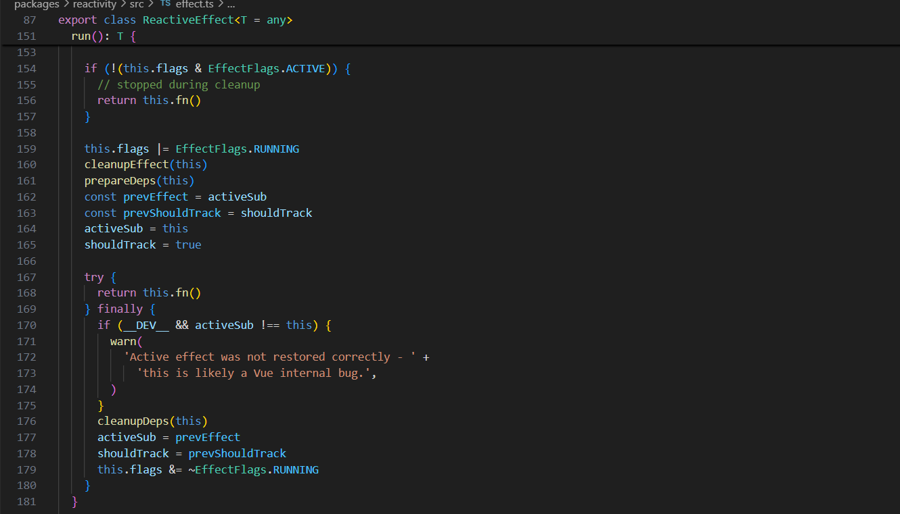

不过两者在依赖收集时和effect建立关系的实现上有所区别，Vue3引入了Link类，

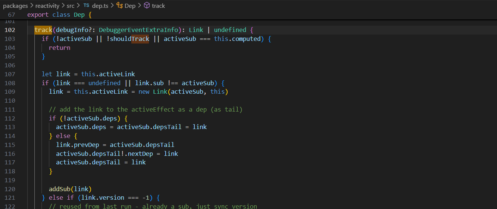

链表的指向解释：

```shell
# Before the operation:

deps → A ↔ B ↔ C ← depsTail  

# After link.prevDep = activeSub.depsTail:

deps → A ↔ B ↔ C ← depsTail  
                  ↑  
                  |  
                 link  

# After activeSub.depsTail!.nextDep = link:

deps → A ↔ B ↔ C → link  
                ↑  
                |  
             depsTail  

# After activeSub.depsTail = link:

deps → A ↔ B ↔ C ↔ link ← depsTail  
```

清除依赖的时候通过遍历链表清除

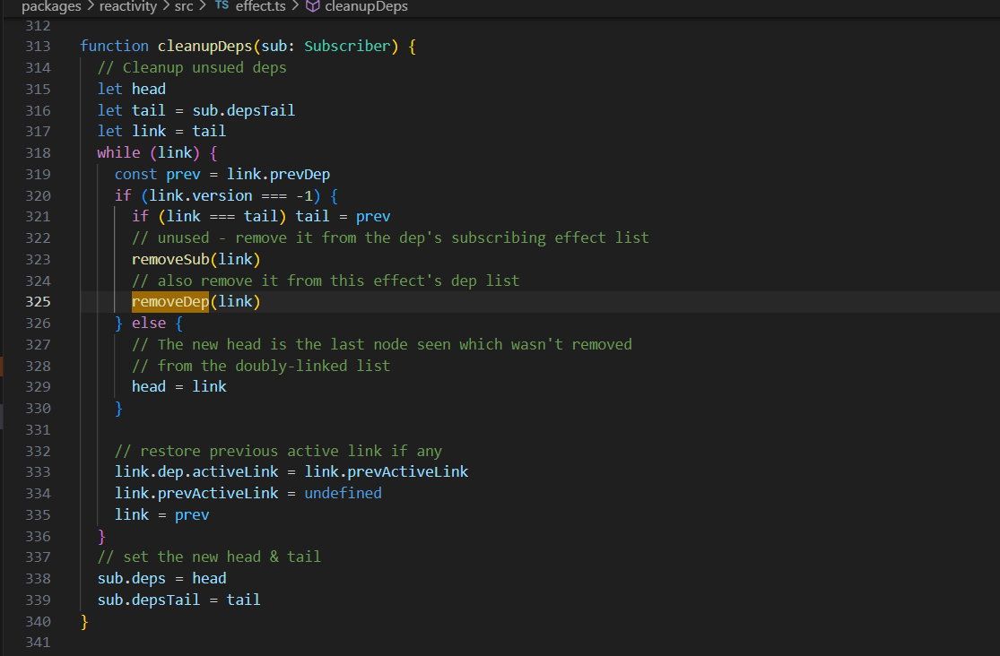

Reactive Effect Dep Link 三者的关系为：

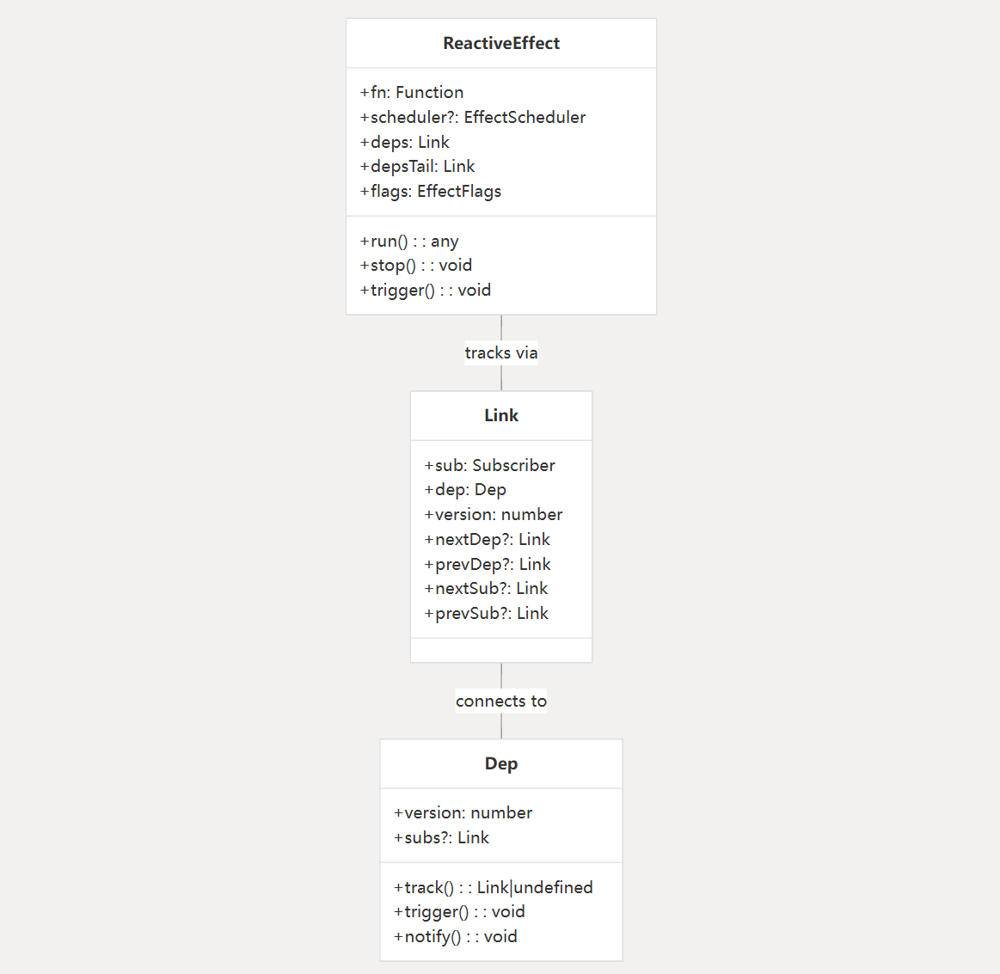

对比Vue2为 Observer Dep Watcher，这里无需关注Observer，因为Observer应该属于数据响应式阶段的内容，在Vue3中与之对应的是Reactive API（ref, reactive, computed等等）所以，仅仅对比Dep Watcher 和 Dep Reactive Effect Link

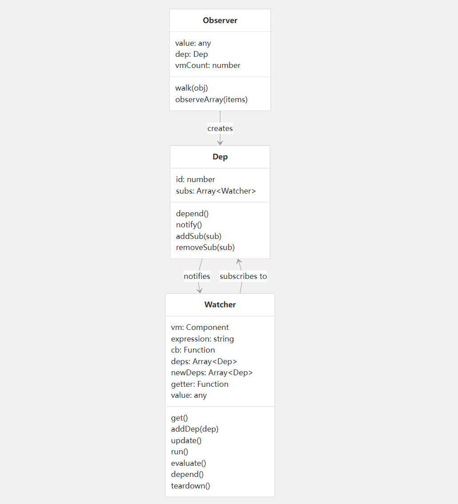