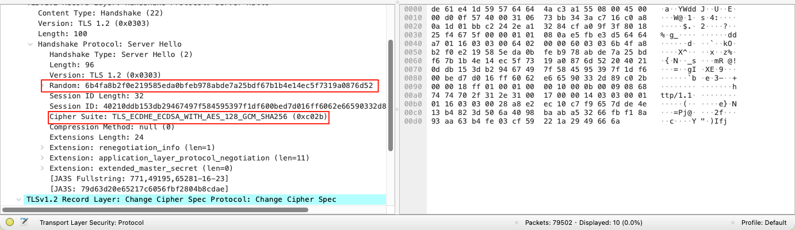

Wireshark是一个抓包工具

## 基本的使用

## HTTP三次握手与四次挥手

接下来，我们访问`http://nginx.org/LICENSE`，通过Wireshark的抓包来看下HTTP三次握手和四次挥手的过程

首先，我们需要请求`http://nginx.org/LICENSE`，可以使用浏览器或者终端进行请求

然后，找到nginx.org的ip地址，输入到Wire的过滤器中，过滤出我们想要的抓包数据，这是我的过滤器`ip.addr == 3.125.197.172 or ip.addr == 52.58.199.22`

IP地址可以通过浏览器的控制台和终端ping nginx.org查看

下图是抓包后的截图：

红色框内是三次握手的请求：

1. source（客户端）向destination（服务端，nginx的服务52.58.199.22）发送一条SYN的TCP消息（其中Seq=0），表示建立请求
2. destination接受到消息之后，往source发送一条SYN+ACK的TCP消息（Seq=0,ACK=1），表示收到建立请求的消息，并确认可以建立请求
3. source接收到消息之后，往destination发送一条ACK的TCP消息（Seq=1,ACK=1），表示确认建立请求

可以对比下图：

接下来是蓝色框内的四次挥手：

1. source向destination发送一条FIN的TCP消息（其中Seq=x,Ack=y），客户端进入等待终止的阶段
2. 服务端收到客户端发送的终止通信的消息，给客户端发送一条FIN的TCP消息（Seq=y,Ack=x+1），等待客户端确认断开
3. 客户端往服务端发送一条ACK的TCP消息（Seq=x+1+1,Ack=y+1），表示确认断开

可以对比下图：

这里我们发现抓包的数据和我们往常看到的四次挥手不太一致，只有三次，按照上图第三步之所以存在是因为服务端还有数据在往客户端发，服务端在第二步只会先发搜狗一个ACK消息，在第三步发送FIN+ACK的消息，客户端收到FIN+ACK的消息才会发起第四步，断开连接。
但是，当服务端能够确认没有数据往客户端发送的时候，会将第二步和第三步合起来，直接发送FIN+ACK的TCP消息，也就是我们抓包看到的那样

## HTTPS（TLS加密）

访问 `https://nginx.org/LICENSE`

我们修改下抓包的过滤条件：`ip.addr == 3.125.197.172 or ip.addr == 52.58.199.22 and tls`, 下边是抓取的数据

下边是阮一峰博客中图解tls协议博文的一张图：

我们结合两张图来看下：

1. 客户端发送hello携带SNI字段和TLS的版本号（这里是TLS 1.2），另外，会生成随机数1和支持的加密套件给到服务端，第一次握手完成（4526）

2. 服务端发送hello, 生成随机数2 、选择加密套件和证书给到客户端，第二次握手完成（4566， 4567）

3. 客户端确认服务端发送的证书有效，切换加密套件，生成随机数3随机利用证书的公钥加密这个随机数，给到服务端，第三次握手完成（4599）

4. 服务端利用私钥解密获取随机数3，基于随机数1、随机数2、随机数3和之前约定的加密套件，生成会话秘钥，用于接下来的会话加密，第四次握手完成（4685）

5. 后续的会话内容就是加密的，比如序号4687的抓包数据
