👋本篇内容主要是讲模块联邦的模块是如何被打包、导出到被消费者加载的核心流程，中间会涉及打包后的部分原理。
> 请结合本篇内容准备的Demo项目进行学习：https://github.comzepang/module-federation-practice
大家可以拉取上边的demo代码，配置如下：
## ModuleFederationPlugin配置

先来看下生成者和消费者的插件配置，并给大家解释下相关的作用：
• 生成者（模块提供方）
```ts
{
    new webpack.container.ModuleFederationPlugin({
      name: "producer",
      filename: 'remoteEntry.js',
      exposes: {
        './App': './src/App',
      },
      shared: {
        "react": {singleton: true}, 
        "react-dom": {singleton: true}
      },
    }),
}
```
1. 生成者这边配置了模块联邦容器的名为producer，后续消费方需要配置这个远程模块入口名。
2. 打包生成的模块联邦入口文件为remoteEntry.js
    a. webpack5在打包的时候会输出名为remoteEntry.js的文件
    b. 在消费方那边的入口配置也要指定为这个文件
3. 定义了导出的模块为'./App'，这个同样很关键，在消费方使用的时候需要指定这里定义的模块名
4. 定义了可以共享的依赖：react和react-dom。
    a. 这表示会单独打包出react、react-dome的依赖文件
    b. 注意，这里没有指定具体的版本，只是说明了单例，那么会从项目安装的版本中取具体的版本号，这是非常严格的，如果消费方提供的共享依赖版本号不匹配将不会被采纳。

• 消费方
```ts
{
    new webpack.container.ModuleFederationPlugin({
      name: "comsumer-app",
      remotes: {
        producer: "producer@http://localhost:3002/remoteEntry.js",
      },
      shared: {
        "react": {singleton: true}, 
        "react-dom": {singleton: true}
      },
    }),
}
```
1. 消费方定义了模块联邦容器名，如果消费者同时又作为生产者，那么这个name的作用同上生成者的name的作用
2. 定了remotes配置，这里的key和url和上边生产者定义的是相互对应的
3. 定义了共享依赖：react和react-dom
    a. 这表示会单独打包出react、react-dome的依赖文件
    b. 注意，这里没有指定具体的版本，只是说明了单例，那么会从项目安装的版本中取具体的版本号，由于我的demo项目使用pnpm catalog固定了所有子包的版本，所以这里实际的版本和生成者的一致
👋总之，可以认为这里的shared两边配置是一致的
## 资源加载流

接着，通过下边的命令可以跑起上边的demo项目：
```shell
pnpm i
pnpm run dev
# comsume-app -> http://localhost:3001
# producer-app -> https://localhost:3002进入浏览器访问：http://localhost:3001，可以看到producer app已经被加载
```
进入浏览器访问：http://localhost:3001，可以看到producer app已经被加载
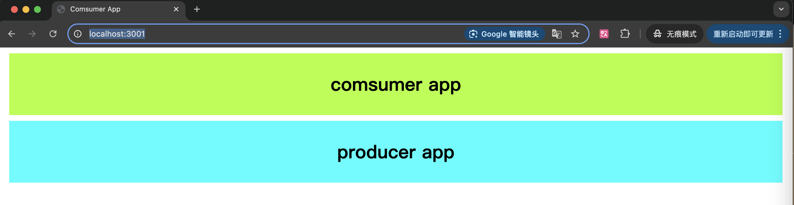
打开控制台可以看到js资源的加载流：
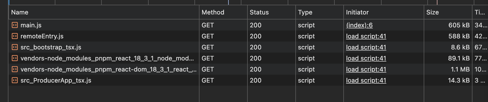
## 核心流程和原理

主要分成两块：消费者和生产者，我们从消费方这边开始（以下代码为了方便阅读并未压缩）
消费者加载生产者
1. 浏览器进入页面加载main.js，这个从html文件内容的script标签可以知道
2. 在入口文件mian.js中其加载的./src/main.js模块（__webpack_require__表示同步加载，你可以认为这个模块的代码是在当前文件）
   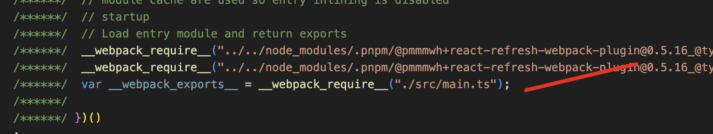
3. 从main.js的内容，我们可以看到会加载src_bootstrap_tsx这个模块（`__webpack_require__.e`表示异步加载，最后通过__webpack_require__.l去下载文件并通过jsop的方式加载模块代码），但是，开始下载这个代码之前会触发__webpack_require__.f上挂载的类似中间件的运行时函数
   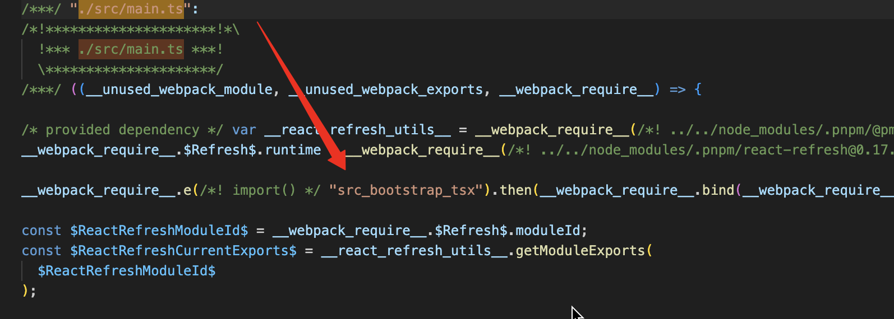
4. webpack模块联邦的插件配置之后呢，会挂载__webpack_require__.f.remotes的运行时函数，也就是说上一步提到的下载src_bootstrap_tsx模块，会经过这个函数。并且从chunkMapping中可以看到，sr_bootstrap_tsx这个模块有对应的远程模块需要下载
   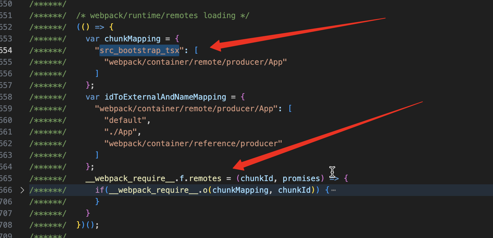
5. 我们打开下这个函内部：
    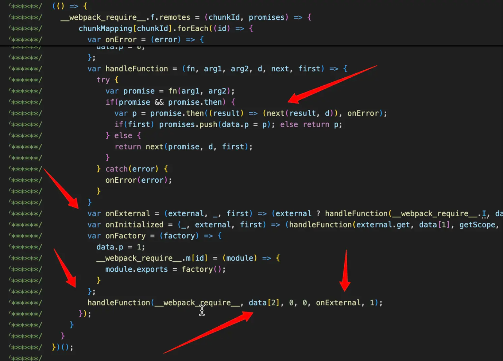
    a. handleFunction是一个通用函数，判断fn函数是否返回promise（有的时候是__webpack_require__）的兼容处理逻辑
    b. 这里的第一次是加载`data[2]`是`webpack/container/reference/producer`，也就我们的远程模块，也就是相当于 `__webpack_require__('webpack/container/reference/producer')`
    c. 来看下这个模块的代码，其实就是从之前模块联邦插件的配置的remotes.producer的远程容器地址，这里会去下载remoteEntry.js的代码，下载完毕之后，remoteEntry.js内的逻辑会挂载到window.producer（远程模块的容器对象），所以，在then方法可以把这个producer返回
    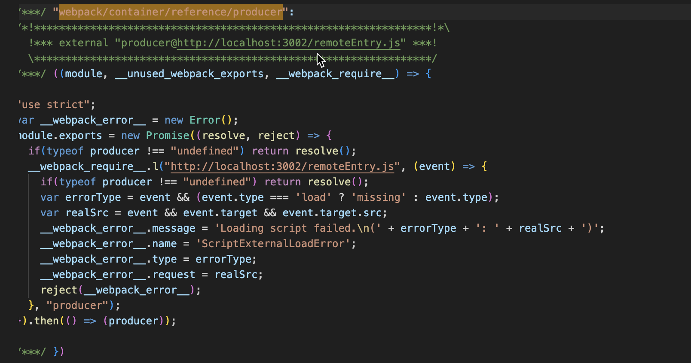
    d. 这一步加载完毕，回到handleFunction，会调用onExternal，内的external其实是上一步拿到的producer了
    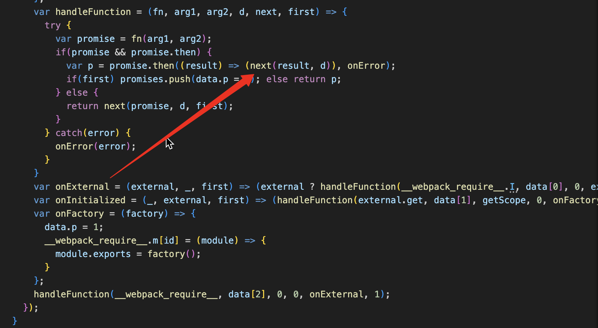
    e. 这里截取了部分代码， 完整的代码也贴了__webpack_require__.f.remotes：
    ```js
    var onExternal = (external, _, first) => (external ? handleFunction(__webpack_require__.I, data[0], 0, external, onInitialized, first) : onError());
    var onInitialized = (_, external, first) => (handleFunction(external.get, data[1], getScope, 0, onFactory, first));
    var onFactory = (factory) => {
        data.p = 1;
      // 这里的id是 webpack/container/remote/producer/App
        __webpack_require__.m[id] = (module) => {
            module.exports = factory();
        }
    };    
    ```
    f. 可以看到external就是调用__webpack_require__.I('default')，初始化共享依赖，这个共享依赖池的scope为'default’，这里之所有是scope是因为在模块联邦的插件上没有配置名称，默认是'default'。当共享依赖初始化完毕，会触发onInitialized，嗲用exernal.get，这里的external其实就是remoteEntry提供的容器对象（具体的内容生产者那块会提到），调用容器对象的get方法获取模块，最后onFactory将producer挂载到webpack的模块池子中，webpack的模块机制，所有的模块都会从这个池子取（`__webpack_require__.m`），这里可以看成是`__webpack_require__.m['webpack/container/reference/producer/App'] = producer`
6. 我们回到上一层来讲初始化共享依赖的逻辑，也就是5.f中提到的__webpack_require__.I，为什么这里我回到了上层来讲，因为从这里开始，其实有两个并行的线。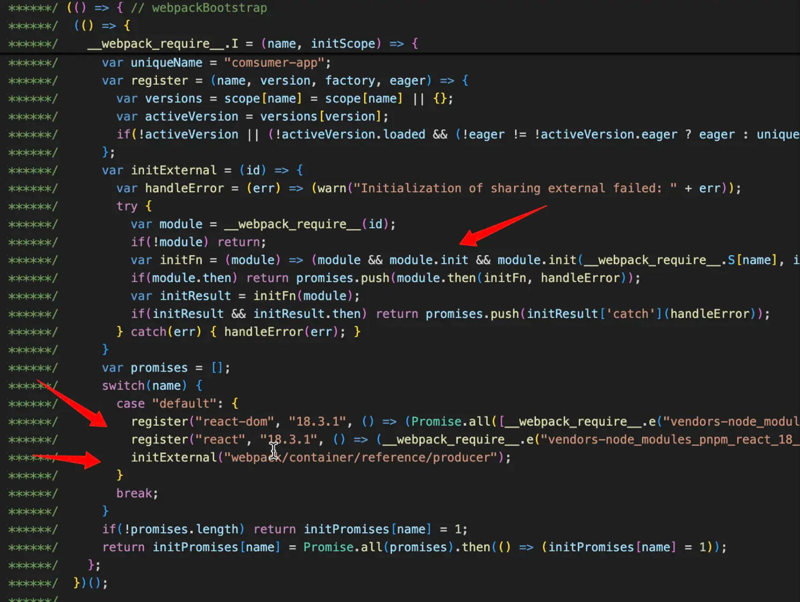
    a. 一条是消费方初始化共享依赖的线（register这里）
    b. 一条是生产者同样会存在一个初始化共享依赖的过程（initExternal这里，内部其实调用了是远程模块容器的init方法）
    c. 那么也就说，假设共享依赖满足可以用使用的情况，最终共享依赖是加载的消费者还是生成者，取决于加载时机。你可能会看到加载的生产者的依赖或者两者的依赖的都有，但是不会存在重复的依赖，如果存在则说明共享依赖是有问题的
7. 共享依赖这里涉及的比较规则比较多，可以先不用关心，我们可以看下共享依赖池的结构：
```js
{
     // 共享池的scope，可能定义多个scope实现共享池的隔离
    'default': {
        // 多个共享依赖
        'react': {
            // 版本可能有多个
            '18.3.1': { loaded: true, eager: true, from: 'comsumer-app',  ....}
        },
        'react-dom': {
            // 版本可能有多个
            '18.3.1': { loaded: true, eager: true, from: 'comsumer-app', ....}
        }
    }
}
```
8. react、react-dom作为共享依赖都是异步加载（这里涉及一个webpack/runtime/jsonp的内容，看下边的webpack JSONP 异步加载模块内容进行拓展）：
`__webpack_require__.e("vendors-node_modules_pnpm_react-dom_18_3_1_react_18_3_1_node_modules_react-dom_index_js")`
9. 接下来回到第5步这里，其实远程模块容器，也就是external加载完毕，对于`__webpack_require__.e('src_boostrap_tsx')`来说就该走下一个运行时函数，也就是`__webpack_require__.comsume`。`__webpack_require__.remotes`主要就是加载远程模块入口容器（注意不包括取模块，这里有个first的参数，仅在第一次会加promises），__webpack_require__.f.comsums是对共享依赖的消费逻辑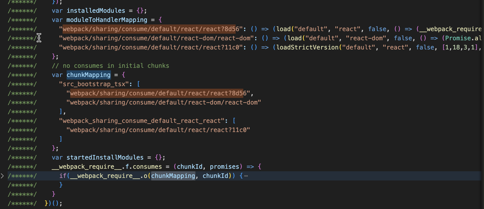
10. 这里的共享依赖消费是指src_bootstrap_tsx除了remotes这里依赖producer，作为消费方的项目，本来就依赖一些模块，比如这里的react、react-dom，webpack需要把这部分和共享依赖关联起来，让项目的依赖能够尽可能的加载共享依赖。当然，因为共享依赖本身是有规则的，所以，webpack给了许多方法去加载共享依赖，比如load loadVersion loadStrictVersion loadSingleton等等（这里需要注意，这些load函数本身是异步的，不会阻塞src_bootstrap_tsx文件下载以及加入到__webpack_require__.m）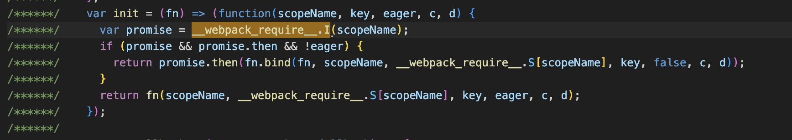
11. 所以，src_bootstrap_tsx的加载经过f.remotes f.comsums f.j，应该有四个promise阻塞
    a. src_bootstrap_tsx依赖：远程模块容器remoteEntry.js（注意不包括容器初始化、取模块，这里有个first的参数，仅在第一次会加promises）
    b. src_bootstrap_tsx依赖：react
    c. src_bootstrap_tsx依赖：react-dom
    d. src_bootstrap_tsx：jsop加载src_bootstrap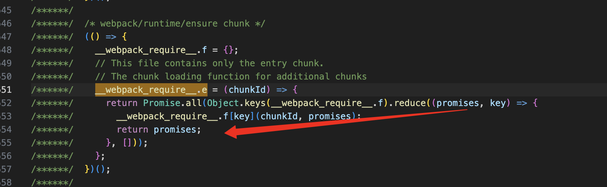
12.  src_boostrap_tsx模块代码装载完毕之后，会从__webpack_require__.m中取./src/boostrap.tsx这个模块执行，然后是App.tsx，最后到producer/app这个引入，这个引入的id已经被webpack翻译成"webpack/container/remote/producer/App"，在__webpack_reqire__.remotes中已经装载完毕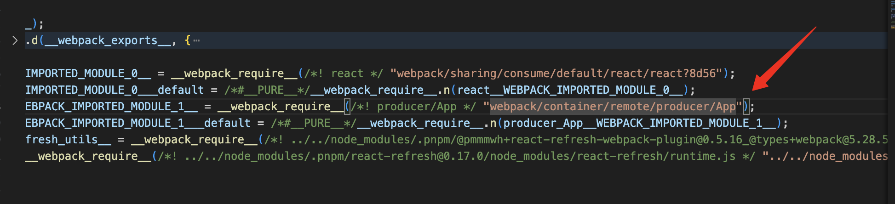

### 生产者导出和初始化

1. 生产者根据模块联邦插件配置会创建remoteEntry.js这个入口文件，入口文件导出模块联邦的容器对象：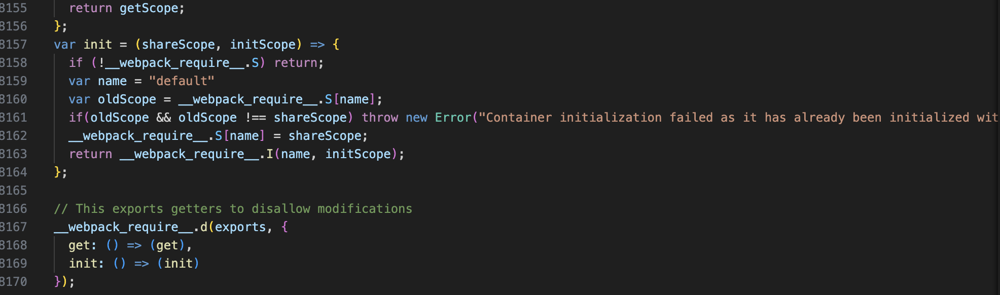
2. 这里就对应了消费者那边加载的时候在__webpack_require__.f.remotes初始化容器和通过get取模块
这里的初始化主要是初始化共享依赖池：__webpack_require__.S，主要的逻辑可以看下__webpack_require__.I，这个函数和消费方的类似，只不过由于demo这里这里没有使用其它的远程模块，所以这里只会注册和初始化共享依赖。这里对应了消费方加载生产者模块的第6步提到的，生产者初始化共享依赖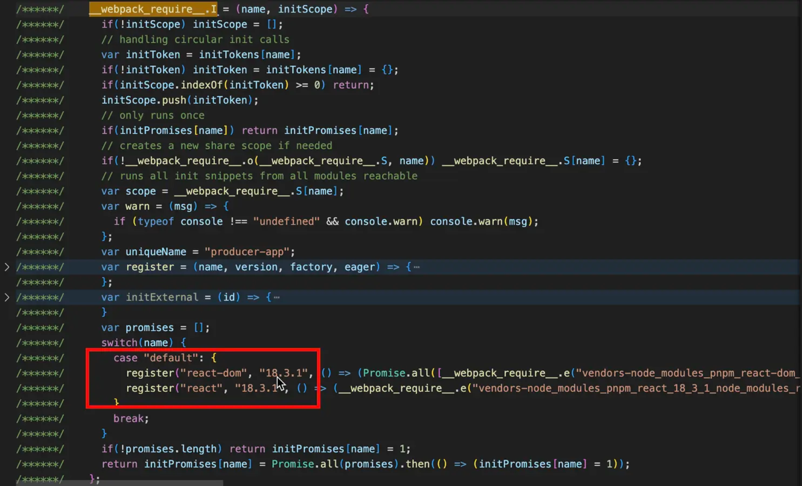
3. 注册共享依赖的过程其实就是去__webpack_require__.S['default']里边找对应的可用依赖，数据结构在上边已经提过。所以，如果在消费方这边已经往共享池中注册了依赖，根据规则比对这里可复用，如果没有，则会去加载。
4. 这里贴一下最终的网络请求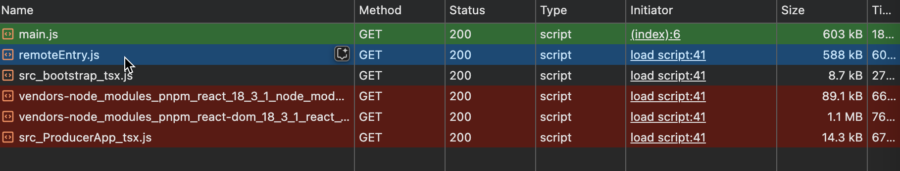
按住shift键位，我们把鼠标移动到remoteEntry.js，绿色为发起remoteEntry的来源，红色为remoteEntry发起的请求，也就说，react、react-dom都是用了生产者提供的共享依赖，所以src_bootstrap_tsx.js的体积才能这么小
5. get函数逻辑看下源码也非常清晰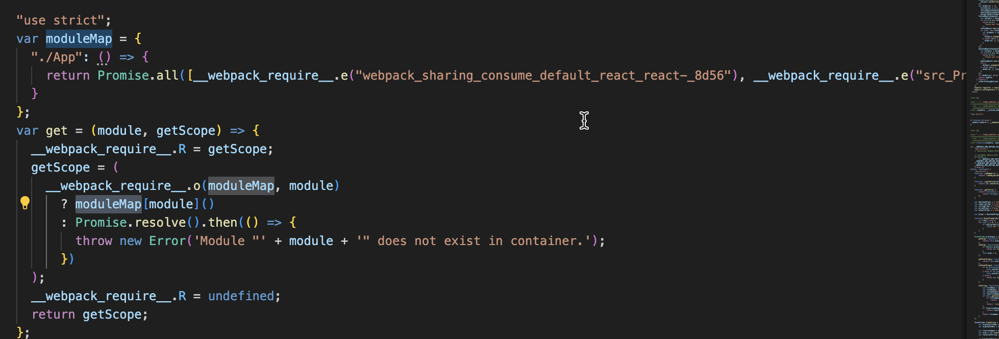
使用__webpack_require__.e异步加载依赖，这个依赖加载同样会经过 
webpack_require.f.consumes处理，然后和消费者一样考虑从共享模块取依赖

## webpack JSONP 异步加载模块
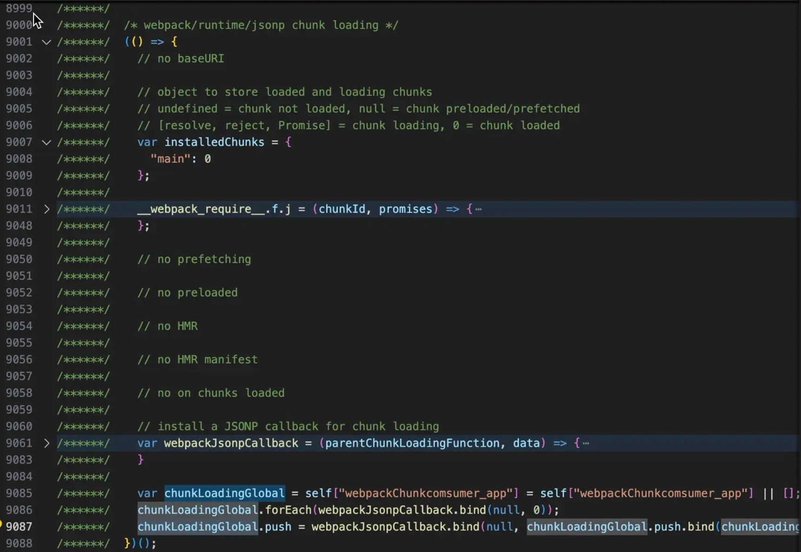
1. 通过__webpack_require__.e()加载的模块，会经过__webpack_require__.f.j这个运行函数，通过__webpack_require__.l下载模块的文件之后挂载到installedChunks 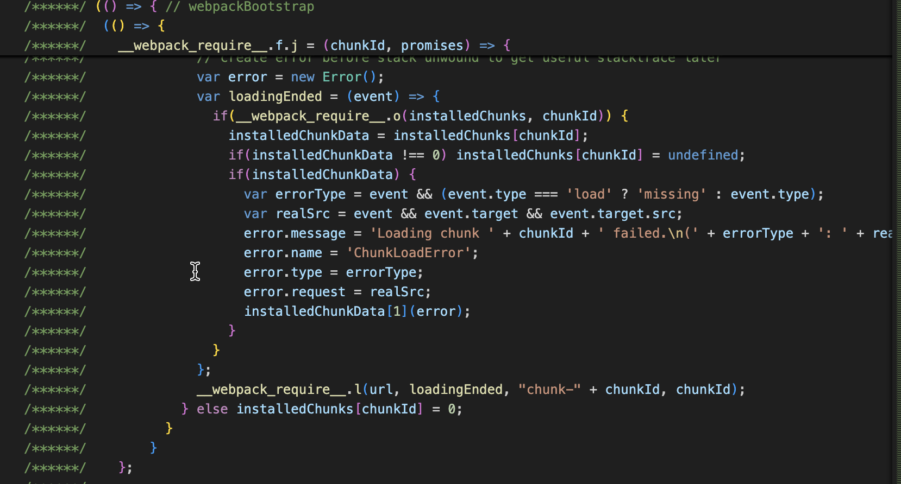 
2. __webpack_require__.l的原理其实就是通过创建script标签下载js，这里需要关注的是下载之后的js其实是会执行一些webpack运行时的代码的，比如：
```js
(self["webpackChunkcomsumer_app"] = self["webpackChunkcomsumer_app"] || []).push([["vendors-node_modules_pnpm_react_18_3_1_node_modules_react_index_js"],{
    "../../node_modules/.pnpm/react@18.3.1/node_modules/react/cjs/react.development.js": ((module, exports, __webpack_require__) => {
    //... react模块的代码
    }）
}])
```
3. 从上边的代码可以看到它往self["webpackChunkcomsumer_app"]中push了react模块，但是，在self["webpackChunkcomsumer_app"].push已经被webpack/runtime/jsonp代码改写：
4. 所以，最终push的react模块就被放到了__webpack_require__.m中

## 代码片段

```js
__webpack_require__.f.remotes
(() => {
    var chunkMapping = {
        "src_bootstrap_tsx": [
            "webpack/container/remote/producer/App"
        ]
    };
    var idToExternalAndNameMapping = {
        "webpack/container/remote/producer/App": [
            "default",
            "./App",
            "webpack/container/reference/producer"
        ]
    };
    __webpack_require__.f.remotes = (chunkId, promises) => {
        if(__webpack_require__.o(chunkMapping, chunkId)) {
            chunkMapping[chunkId].forEach((id) => {
                var getScope = __webpack_require__.R;
                if(!getScope) getScope = [];
                var data = idToExternalAndNameMapping[id];
                if(getScope.indexOf(data) >= 0) return;
                getScope.push(data);
                if(data.p) return promises.push(data.p);
                var onError = (error) => {
                    if(!error) error = new Error("Container missing");
                    if(typeof error.message === "string")
                        error.message += '\nwhile loading "' + data[1] + '" from ' + data[2];
                    __webpack_require__.m[id] = () => {
                        throw error;
                    }
                    data.p = 0;
                };
                var handleFunction = (fn, arg1, arg2, d, next, first) => {
                    try {
                        var promise = fn(arg1, arg2);
                        if(promise && promise.then) {
                            var p = promise.then((result) => (next(result, d)), onError);
                            if(first) promises.push(data.p = p); else return p;
                        } else {
                            return next(promise, d, first);
                        }
                    } catch(error) {
                        onError(error);
                    }
                }
                var onExternal = (external, _, first) => (external ? handleFunction(__webpack_require__.I, data[0], 0, external, onInitialized, first) : onError());
                var onInitialized = (_, external, first) => (handleFunction(external.get, data[1], getScope, 0, onFactory, first));
                var onFactory = (factory) => {
                    data.p = 1;
                    __webpack_require__.m[id] = (module) => {
                        module.exports = factory();
                    }
                };
                handleFunction(__webpack_require__, data[2], 0, 0, onExternal, 1);
            });
        }
    }
})();
```